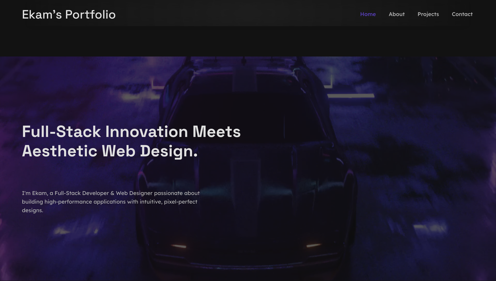

# 🚀 Ekam's Portfolio

<div align="center">
  
  <h3>Full-Stack Innovation Meets Aesthetic Web Design</h3>
</div>

## ✨ Overview

A sleek, cinematic, and futuristic portfolio that showcases my skills and projects as a Full-Stack Developer and Web Designer. Built with modern React, GSAP animations, and responsive design principles to create an immersive user experience.



## 🛠️ Technologies

- **Framework**: React with TypeScript
- **Build Tool**: Vite
- **Styling**: SCSS/SASS with responsive design
- **Animations**: GSAP (GreenSock Animation Platform)
- **Email Integration**: EmailJS
- **UI/UX**: Custom animations, transitions, and responsive layouts

## 🔥 Features

- **Cinematic Entrance**: Custom loader with animated typography
- **Immersive Hero Section**: Background video with text reveal animations
- **Smooth Transitions**: GSAP-powered curtain animations between sections
- **Interactive Elements**: Hover and click animations on all interactive components
- **Responsive Design**: Optimized for all screen sizes from mobile to desktop
- **Contact Form**: Fully functional contact form with EmailJS integration
- **Dynamic Project Showcase**: Interactive cards for showcasing projects
- **Intuitive Navigation**: Sleek navbar with active section highlighting

## 📱 Responsive Design

The portfolio is fully responsive with carefully crafted breakpoints:
- Desktop (1400px+)
- Tablet landscape (1100px)
- Tablet portrait (768px)
- Mobile (600px)
- Small mobile (400px)
- Landscape orientations with special layouts

## 🎨 Design Principles

- **Futuristic Aesthetic**: Dark theme with accent colors and subtle UI elements
- **Typography Hierarchy**: Clear typography hierarchy for improved readability
- **Animation Purpose**: Animations that enhance UX rather than distract
- **White Space Usage**: Strategic use of white space for elegant layouts
- **Consistent Motion**: Cohesive animation timing and easing across components

## 💻 Local Development

```bash
# Clone the repository
git clone https://github.com/username/portfolio.git

# Navigate to the project directory
cd portfolio

# Install dependencies
npm install

# Start development server
npm run dev

# Build for production
npm run build

# Preview production build
npm run preview
```

## 🌐 Environment Setup

Create a `.env` file in the root directory with the following variables:

```
VITE_LINKEDIN_URL=your_linkedin_url
VITE_INSTAGRAM_URL=your_instagram_url
VITE_GITHUB_URL=your_github_url
VITE_EMAIL_ADDRESS=your_email
VITE_PHONE_NUMBER=your_phone
```

## 📄 Project Structure

```
/src
├── assets/         # Static assets, images, videos
├── components/     # React components
│   ├── About/      # About section
│   ├── Contact/    # Contact form section
│   ├── Footer/     # Footer component
│   ├── Hero/       # Hero section
│   ├── Loader/     # Initial loading animation
│   ├── Navbar/     # Navigation component
│   ├── Work/       # Projects showcase
│   └── common/     # Reusable components
├── context/        # React context providers
├── utils/          # Utility functions and animations
└── App.tsx         # Main application component
```

## 🚀 Performance Optimization

- Lazy loading of images and video content
- GSAP animations optimized for performance
- Code splitting and asset optimization
- Responsive image handling
- Clean, semantic HTML structure

## 🔗 Connect With Me

- [LinkedIn](https://www.linkedin.com/in/ekam2552)
- [GitHub](https://github.com/Ekam2552)
- [Email](mailto:ekam2552@gmail.com)

## 📜 License

This project is licensed under the MIT License - see the LICENSE file for details.

---

<p align="center">Designed with passion, coded with precision.</p>
